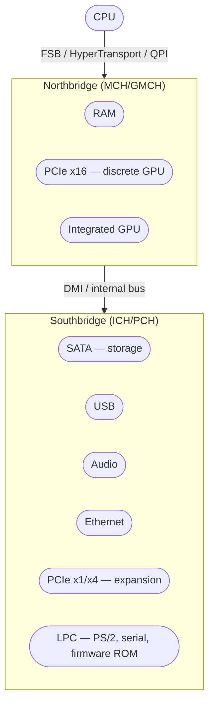
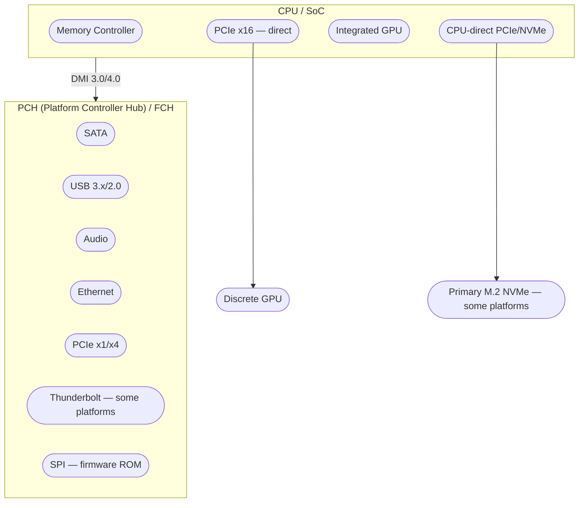

# Hardware Topology

Understanding which firmware settings affect which devices requires
understanding how the devices are connected. The hardware topology
of an x86 system determines data paths, latency characteristics,
and which settings in firmware affect which subsystems.

## The traditional northbridge/southbridge architecture

From the late 1990s through the early 2010s, x86 systems used a
two-chip chipset architecture:

**Northbridge** (Memory Controller Hub / MCH, or GMCH when it
included integrated graphics) handled the high-bandwidth, latency-
sensitive connections: the CPU's front-side bus, system memory, and
the primary PCIe slot for the discrete GPU. Because memory and the
GPU needed the fastest possible path to the CPU, the northbridge sat
physically and electrically between them.

**Southbridge** (I/O Controller Hub / ICH) handled everything
else: storage (SATA, IDE), USB, audio, network, and low-speed
expansion slots. The southbridge connected to the northbridge via
a dedicated link (DMI on Intel platforms), which was the bottleneck
— all I/O traffic from storage, USB, and network had to traverse
this link to reach the CPU and memory.

This architecture had a clear firmware implication: **northbridge
settings** (memory timings, GPU configuration, PCIe x16 slot
settings) and **southbridge settings** (SATA mode, USB
configuration, audio, network) appeared as separate sections in
firmware setup because they controlled separate physical chips.

## The modern reality: SoC integration

Starting around 2011 (Intel Sandy Bridge, AMD Fusion), the
northbridge was absorbed into the CPU die. The memory controller
moved onto the CPU. The primary PCIe lanes moved onto the CPU. The
northbridge chip disappeared from the motherboard.

What remains is the **Platform Controller Hub (PCH)** on Intel
systems or the **Fusion Controller Hub (FCH)** on AMD systems —
the evolved southbridge, now the only chipset component:

The practical consequences for firmware settings:

**Memory settings are CPU settings.** Because the memory controller
is on the CPU die, memory timings, XMP/EXPO profiles, and memory
frequency are configured through the CPU's memory controller
interface, not a separate chipset. In firmware, these settings
appear under names like "DRAM Configuration," "Memory Settings," or
"AI Tweaker / OC Tweaker" (on enthusiast boards).

**Primary PCIe is CPU-direct.** The discrete GPU's PCIe x16 slot
connects directly to the CPU — no intermediate chip. This means
GPU-related firmware settings (Above 4G Decoding, Resizable BAR,
PCIe generation for the primary slot) are CPU-level settings.

**NVMe may be either.** Depending on the platform, the primary M.2
NVMe slot may connect directly to CPU PCIe lanes (lower latency,
full bandwidth) or through the PCH (shared DMI bandwidth). This
distinction matters for storage performance and is visible in the
firmware's PCIe lane allocation settings.

**Everything else goes through the PCH and shares the DMI link.**
SATA, USB, audio, Ethernet, Thunderbolt, and secondary PCIe slots
all connect through the PCH. The DMI link's bandwidth (DMI 3.0 is
~3.9 GB/s, DMI 4.0 is ~7.9 GB/s) is the shared ceiling for all
PCH-attached devices. This is rarely a bottleneck for development
workstations but matters if the machine has multiple NVMe drives,
10GbE networking, and USB peripherals all running through the PCH
simultaneously.

## Why this matters for firmware configuration

Firmware settings menus are organized by the hardware topology.
Understanding the topology tells you where to find settings and
what affects what:

| Firmware section | Typically controls | Hardware location |
|-----------------|-------------------|-------------------|
| CPU Configuration | Core count, hyper-threading, virtualization (VT-x/AMD-V) | CPU |
| Memory / DRAM | Timings, frequency, XMP/EXPO profiles | CPU memory controller |
| GPU / Display | Primary display, iGPU, multi-monitor | CPU (iGPU), CPU PCIe (dGPU) |
| PCIe / Slots | Lane allocation, generation, bifurcation | CPU lanes + PCH lanes |
| Storage / SATA | SATA mode (AHCI/RAID), NVMe | PCH (SATA), CPU or PCH (NVMe) |
| USB | Port configuration, legacy support, power | PCH |
| Thunderbolt | Security level, PCIe tunneling | PCH (or CPU-direct on newer platforms) |
| Audio / Onboard | Enable/disable onboard audio, HD Audio | PCH |
| Network / LAN | Enable/disable, wake-on-LAN, PXE | PCH |
| Power / ACPI | Sleep states, wake sources, power limits | CPU + PCH (both involved) |

When a firmware setting does not appear where expected, the topology
usually explains why. A "PCIe Settings" section that does not
include the primary GPU slot is showing PCH-attached PCIe lanes —
the GPU slot's settings are under "CPU Configuration" or a separate
"GPU" section because those lanes are CPU-direct.

## Intel vs AMD topology differences

The architecture is broadly similar but the naming and some
structural details differ:

| Concept | Intel | AMD |
|---------|-------|-----|
| Chipset | Platform Controller Hub (PCH) | Fusion Controller Hub (FCH) |
| CPU-chipset link | DMI (Direct Media Interface) | Infinity Fabric link |
| Memory controller | On-die since Sandy Bridge (2011) | On-die since Athlon 64 (2003) |
| iGPU | Intel UHD / Iris (most desktop + mobile CPUs) | Radeon (APUs only; absent on non-G desktop SKUs) |
| CPU-direct PCIe | Gen 4/5, varies by SKU | Gen 4/5, varies by SKU |
| Virtualization | VT-x (CPU), VT-d (IOMMU) | AMD-V / SVM (CPU), AMD-Vi (IOMMU) |

AMD moved the memory controller on-die nearly a decade before Intel,
and AMD's Infinity Fabric provides higher bandwidth between CPU and
FCH than Intel's DMI on most platforms. These differences rarely
affect firmware configuration decisions for a development
workstation but explain why the same setting may appear in a
different menu location or use a different name between Intel and
AMD systems.

## The laptop case

Laptop firmware exposes fewer settings than desktop firmware because
the hardware is fixed. There are no expansion slots to configure, no
PCIe bifurcation options, and no memory timing adjustments (LPDDR
memory on modern laptops is soldered and its timings are fixed).

What laptop firmware *does* expose — and what matters for a Linux
development workstation:

- **Virtualization (VT-x / AMD-V / SVM):** Often disabled by
  default on consumer laptops. Must be enabled for Docker, VMs, and
  tools that use hardware virtualization.
- **Secure Boot:** Almost always enabled by default. The
  [Secure Boot](secure-boot.md) page covers when and how to manage
  it.
- **Thunderbolt security:** Controls whether Thunderbolt devices are
  trusted without user approval. See the
  [USB and Thunderbolt](usb.md) page.
- **Battery charge thresholds:** Lenovo ThinkPads expose start/stop
  charge thresholds in firmware. Setting these (e.g., start at 75%,
  stop at 80%) extends battery lifespan for machines that spend most
  of their time plugged in. See the
  [Power and Thermal](power-thermal.md) page.
- **SATA/NVMe mode:** Occasionally relevant if installing Linux
  alongside a pre-installed Windows that used Intel RST (RAID mode).
  See the [Storage](storage.md) page.
