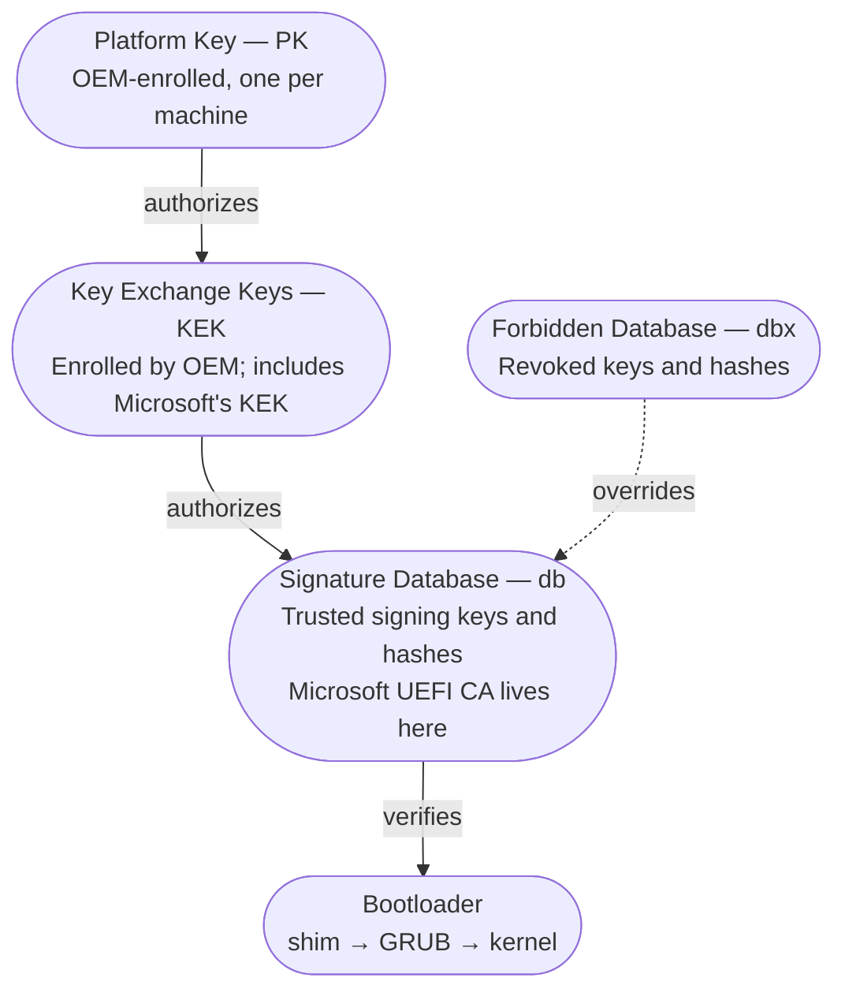

# Secure Boot

Secure Boot is a UEFI feature that ensures only cryptographically
signed code executes during the boot process. It is part of the UEFI
specification, implemented by every modern firmware vendor, and
enabled by default on virtually all machines shipped since 2012.

The purpose is straightforward: prevent bootkits, rootkits, and
other malware that operates below the OS by intercepting the boot
chain. Before Secure Boot, anything written to the Master Boot
Record or the first sectors of a bootable disk would execute with
full hardware access, before any OS security mechanisms loaded.
Secure Boot closes that attack vector by requiring every stage of
the boot process — bootloader, kernel, drivers — to present a valid
cryptographic signature before execution.

For Linux workstation users, Secure Boot is the firmware feature
most frequently disabled without understanding — and most
frequently worth keeping enabled.

## The chain of trust

Secure Boot works by establishing a chain of cryptographic
verification from firmware to kernel:



**Platform Key (PK).** The root of trust. Set by the OEM at the
factory. The PK owner can modify the KEK list, which in turn
controls what can modify the db and dbx. On consumer machines, the
PK belongs to the OEM (Lenovo, Dell, HP). On DIY machines, the PK
is typically a Microsoft key or is unset (Secure Boot disabled by
default).

**Key Exchange Keys (KEK).** Keys authorized to modify the
signature database. The OEM's KEK and Microsoft's KEK are typically
enrolled by default. The KEK does not directly sign bootloaders —
it authorizes changes to the list of keys that sign bootloaders.

**Signature Database (db).** The list of trusted signing
certificates and hashes. Any bootloader signed by a certificate in
the db is permitted to execute. The critical entry is **Microsoft's
UEFI Third Party Marketplace CA** — this is the certificate that
signs `shim`, the first-stage bootloader that most Linux
distributions use to boot under Secure Boot.

**Forbidden Signature Database (dbx).** The revocation list.
Certificates or hashes listed here are blocked regardless of
whether they appear in the db. Microsoft periodically issues dbx
updates to revoke compromised bootloaders (the 2022-2023 "boot
hole" vulnerabilities triggered several waves of revocations).

## How Linux distributions boot under Secure Boot

Most major Linux distributions (Fedora, Ubuntu, Debian, openSUSE,
RHEL) support Secure Boot out of the box using a three-stage chain:

```
Firmware (verifies shim against db)
  → shim (signed by Microsoft's UEFI CA)
    → GRUB (signed by the distribution's key, verified by shim)
      → kernel (signed by the distribution's key, verified by shim)
```

### shim

`shim` is a small first-stage bootloader signed by Microsoft's UEFI
Third Party Marketplace CA. Because Microsoft's certificate is in
the firmware's db on virtually all machines, shim passes Secure
Boot verification. shim then loads GRUB, verifying GRUB's signature
against the distribution's own signing key, which is embedded in
shim.

shim also manages the **Machine Owner Key (MOK)** database — a
supplemental key store that allows the machine owner to enroll
additional trusted keys without modifying the firmware's db. This
is the mechanism that enables custom kernels, third-party kernel
modules, and DKMS-built drivers to work under Secure Boot.

### The distribution's signing key

Each distribution maintains its own signing key. The distribution
signs its GRUB binary and its kernel packages with this key. shim
trusts this key because it is embedded in the shim binary that
Microsoft signed. The chain is: firmware trusts Microsoft, Microsoft
trusts shim, shim trusts the distribution.

### The kernel

Distribution-provided kernels are signed by the distribution's key.
When GRUB loads the kernel, shim verifies the kernel's signature.
If the signature is valid, the kernel loads. If not, boot fails
with a Secure Boot violation.

This means that **a kernel you compile yourself will not boot under
Secure Boot** unless you sign it with a key enrolled in the MOK
database or the firmware's db.

## MOK: Machine Owner Keys

MOK is the mechanism that makes Secure Boot usable for Linux users
who need to go beyond the distribution's signed kernel and modules.

### When MOK is needed

- **DKMS modules.** Kernel modules built by DKMS (Dynamic Kernel
  Module Support) — such as NVIDIA proprietary drivers, VirtualBox
  host modules, or ZFS — are not signed by the distribution. Without
  MOK enrollment, Secure Boot blocks them at load time.
- **Custom kernels.** A kernel compiled from source is not signed
  by the distribution. It must be signed with a MOK-enrolled key.
- **Third-party kernel modules.** Any module not distributed in the
  distribution's signed kernel package.

### Enrolling a MOK key

The process involves generating a key pair, signing the module or
kernel, and enrolling the public key in the MOK database via
`mokutil`:

```bash
# Generate a MOK key pair
openssl req -new -x509 -newkey rsa:2048 \
  -keyout /root/mok-signing.key \
  -outform DER -out /root/mok-signing.pub \
  -nodes -days 36500 \
  -subj "/CN=Machine Owner Key/"

# Enroll the public key in MOK
sudo mokutil --import /root/mok-signing.pub
# mokutil will prompt for a one-time password

# Reboot — shim's MOK Manager will appear before GRUB
# Select "Enroll MOK" → "Continue" → enter the password
# The key is now trusted for this machine
```

After enrollment, modules signed with the corresponding private key
will pass Secure Boot verification:

```bash
# Sign a DKMS-built kernel module
sudo /usr/src/kernels/$(uname -r)/scripts/sign-file \
  sha256 \
  /root/mok-signing.key \
  /root/mok-signing.pub \
  /path/to/module.ko
```

### Automating DKMS signing

On Fedora and Ubuntu, DKMS can be configured to automatically sign
modules at build time:

**Fedora (with akmods/kmodtool):**

Fedora's `akmods` framework handles signing automatically when a
MOK key pair exists at the expected paths. The `kmodtool` scripts
check for signing keys and sign modules during the RPM build.

**Ubuntu/Debian:**

Ubuntu's DKMS integration includes a signing hook. During
installation of DKMS packages (like `nvidia-driver`), the installer
prompts to create a MOK key and enroll it. On subsequent kernel
updates, DKMS rebuilds and re-signs the modules automatically.

```bash
# Check which MOK keys are enrolled
mokutil --list-enrolled

# Check the Secure Boot state
mokutil --sb-state
# Expected output: "SecureBoot enabled"

# Test whether a specific module is signed
modinfo <module_name> | grep signer
# Should show the MOK key's CN or the distribution's signer
```

### MOK key security

The MOK private key (`mok-signing.key` in the examples above) can
sign any kernel module that the machine will trust. Protect it
accordingly:

- Store it with restricted permissions (`chmod 400`, owned by root).
- Do not store it in a world-readable location or commit it to
  version control.
- Consider storing it offline or in a credential vault if the
  machine is not regularly building custom modules.
- The MOK public key (`mok-signing.pub`) is safe to share — it is
  already in the machine's MOK database.

## When to disable Secure Boot

The advice in most Linux forum posts is "disable Secure Boot."
This is almost always unnecessary and sacrifices a real security
boundary for convenience. Secure Boot should be disabled only
when:

- **The distribution does not support Secure Boot.** Some niche or
  rolling-release distributions do not ship a signed shim. Arch
  Linux, for example, does not include Secure Boot support in its
  default installation (though community packages like
  `shim-signed` exist).
- **The firmware has a broken Secure Boot implementation.** Some
  older or budget firmware implements Secure Boot incorrectly —
  rejecting valid signatures, failing to load the MOK manager, or
  producing boot loops. This is rare on current-generation hardware
  from major vendors.
- **You are debugging a boot failure and need to isolate the
  cause.** Temporarily disabling Secure Boot to determine whether
  it is the source of a boot failure is reasonable. Re-enable it
  after diagnosis.

In all other cases — including custom kernels and third-party
drivers — MOK enrollment is the correct solution, not disabling
Secure Boot.

## Secure Boot and dual-boot

Dual-booting Linux alongside Windows with Secure Boot enabled
works correctly on most systems because both operating systems use
the same trust chain:

- Windows is signed by Microsoft's Windows Production CA (in the
  firmware's db).
- Linux's shim is signed by Microsoft's UEFI Third Party
  Marketplace CA (also in the firmware's db).
- Both pass firmware verification.

GRUB can chainload the Windows Boot Manager without Secure Boot
conflicts. The EFI boot entries for both operating systems coexist
on the ESP.

The complication arises with **dbx updates.** Microsoft
periodically revokes compromised bootloader signatures. A dbx
update applied through Windows Update may revoke an older version
of shim, preventing Linux from booting until shim is updated to a
non-revoked version. The fix is straightforward — boot from a USB
live environment and update the shim package — but the failure is
surprising if unexpected.

To minimize dual-boot Secure Boot issues:

- Keep the Linux distribution's shim and GRUB packages up to date.
- After a major Windows update, verify that Linux still boots
  before shutting down.
- Maintain a UEFI-bootable USB with a recent Linux live environment
  for recovery.

## Firmware Secure Boot settings

The firmware's Secure Boot settings are typically found under
"Security" or "Boot" sections:

| Setting | Description | Recommendation |
|---------|-------------|----------------|
| **Secure Boot** | Enable/Disable | Enable |
| **Secure Boot Mode** | Standard / Custom | Standard (unless enrolling custom PK/KEK) |
| **Key Management** | View/modify PK, KEK, db, dbx | Leave default unless enrolling platform-level keys |
| **Restore Factory Keys** | Reset to OEM-enrolled keys | Use if key enrollment goes wrong |
| **Clear All Keys** | Remove all keys (enters Setup Mode) | Required for enrolling a custom PK |

**Setup Mode** is a special state where Secure Boot is technically
enabled but no keys are enrolled — the firmware will accept any
binary. This is the starting point for enrolling a fully custom
chain of trust (your own PK, KEK, and db entries). This is an
advanced configuration used primarily for hardened systems that
trust only the owner's keys and not Microsoft's.

## Verifying Secure Boot status from Linux

```bash
# Is Secure Boot enabled?
mokutil --sb-state

# What keys are in the firmware's db?
mokutil --db

# What keys are in the MOK database?
mokutil --list-enrolled

# What is in the dbx (revocation list)?
mokutil --dbx

# Is the running kernel signed?
sudo pesign -S -i /boot/vmlinuz-$(uname -r)

# Bootctl status (systemd-boot systems)
bootctl status
```

## Questions to ask

1. Is Secure Boot enabled? If not, why was it disabled, and does
   the original reason still apply?
2. Are all installed kernel modules signed? `modinfo <module>` for
   each loaded module should show a signer.
3. Is a MOK key enrolled? If DKMS modules are in use, MOK enrollment
   is required for Secure Boot compatibility.
4. When was shim last updated? An outdated shim risks revocation by
   a future dbx update.
5. If dual-booting: is there a recovery plan for a dbx revocation
   that blocks the Linux bootloader?
