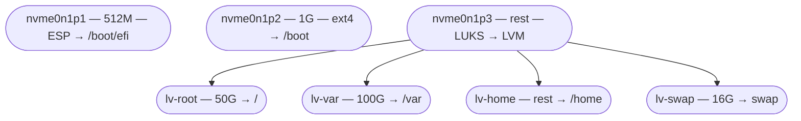
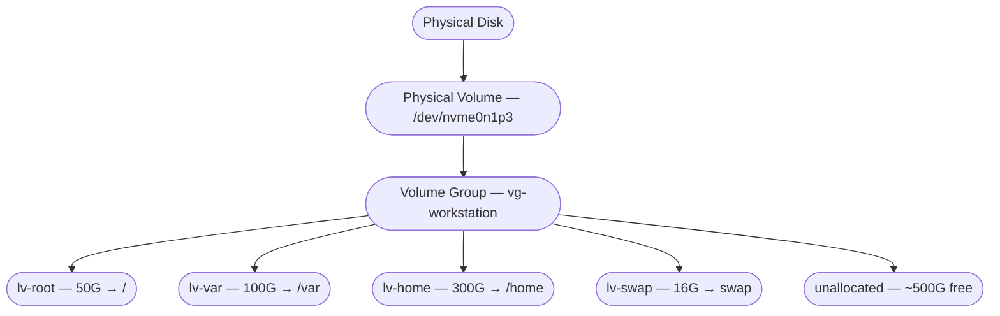
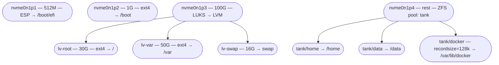
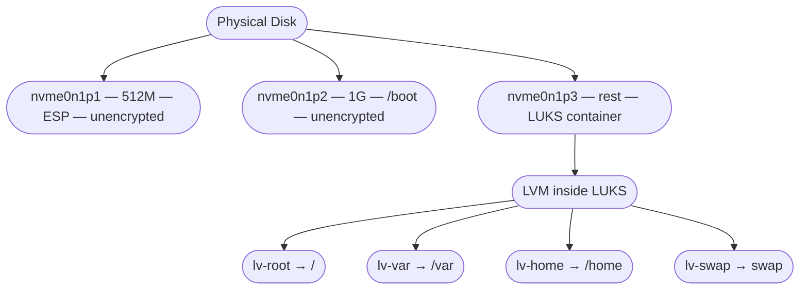

# Disk and Partition Strategy

## Why this page exists

A developer opens their laptop on the morning of their wedding to
review the vows they wrote a couple of weeks earlier. The machine will not
boot. The login screen never appears. After twenty minutes of
increasingly panicked troubleshooting from a phone hotspot, the
cause surfaces: `/var` is full. Docker images, container layers,
build caches, and log files have consumed every byte of the 20GB
logical volume that the installer allocated to `/var` six months
ago. The machine cannot boot because systemd cannot write to its
journal. The vows are on the root filesystem, which is fine — but
the machine does not get far enough to let anyone read them.

The vows were rewritten from memory, day-of, and the marriage
survived. The partition layout did not.

This is not an exotic failure. It is the predictable consequence of
accepting an installer's default partition layout on a machine used
for software development. The defaults are designed for general
desktop use — web browsing, office applications, media consumption.
A development workstation runs Docker, builds container images,
compiles large projects, manages multiple runtime versions, runs
local databases, and stores gigabytes of package caches. The
default layout does not account for any of this.

This page covers the decisions that should be made at installation
time — partition scheme, filesystem type, LVM configuration, swap
strategy, and encryption layout — with the specific needs of a
development workstation in mind.

## Partition strategies

### The single-partition approach

The simplest layout: one partition for the ESP, one partition for
everything else (mounted as `/`).

```
/dev/nvme0n1p1   512M    EFI System Partition   /boot/efi
/dev/nvme0n1p2   rest    Linux filesystem       /
```

**Advantages:** Simple. No mount-point sizing decisions. No risk
of one mount point filling while another has free space. Disk
utilization is optimal — every byte of free space is available to
every directory.

**Disadvantages:** No isolation. A runaway process that fills the
disk takes down the entire system. A corrupted filesystem affects
everything. No per-mount-point filesystem options (noexec, nosuid
on `/tmp`). Snapshots and backups are all-or-nothing.

**When to use it:** VMs, throwaway environments, machines that will
be reinstalled frequently, or situations where simplicity outweighs
every other concern. Not recommended for a primary development
workstation.

### Separate mount points

The traditional Unix approach: different directories on different
partitions, each sized for its expected use.



**Advantages:** Isolation. A full `/var` does not prevent `/home`
from working. Different mount options per partition (`/tmp` with
`noexec,nosuid`; `/var` with `nodev`). Individual mount points can
use different filesystems. Snapshots can target specific volumes.

**Disadvantages:** Sizing decisions at install time. Every
partition boundary is a guess about future usage. A 50GB root that
turns out to need 30GB and a 100GB `/var` that turns out to need
200GB means wasted space on root and a crisis on `/var` — even
though the disk has plenty of free space in aggregate.

This is the layout that produces the wedding-vows failure. The
question is not whether separate mount points are a good idea (they
are). The question is how to size them without predicting the
future.

### LVM: the answer to sizing

LVM (Logical Volume Manager) sits between the physical partitions
and the filesystems, providing a virtualization layer that decouples
storage allocation from physical disk layout. The key capability:
**logical volumes can be resized after creation.**



The critical practice: **do not allocate all disk space at install
time.** Leave a substantial portion of the volume group unallocated.
When a logical volume needs more space, extend it into the free
pool:

```bash
# Check current allocation
sudo vgs
# VG              #PV #LV #SN Attr   VSize    VFree
# vg-workstation    1   4   0 wz--n- 953.87g  503.87g

# Check logical volume sizes
sudo lvs
# LV      VG              Attr       LSize
# lv-root vg-workstation  -wi-ao---- 50.00g
# lv-var  vg-workstation  -wi-ao---- 100.00g
# lv-home vg-workstation  -wi-ao---- 300.00g
# lv-swap vg-workstation  -wi-a-----  16.00g

# Extend /var by 50GB
sudo lvextend -L +50G /dev/vg-workstation/lv-var

# Resize the filesystem to fill the new space
# ext4:
sudo resize2fs /dev/vg-workstation/lv-var
# XFS:
sudo xfs_growfs /var
# Btrfs:
sudo btrfs filesystem resize max /var
```

The ext4 and Btrfs resize operations can be performed online — no
unmount required, no downtime. XFS has always supported online
growth. This means a full `/var` at 3am is a two-command fix, not
a boot failure:

```bash
sudo lvextend -L +50G /dev/vg-workstation/lv-var
sudo resize2fs /dev/vg-workstation/lv-var
```

### Recommended development workstation layout

The following layout accounts for development workstation realities:
Docker images in `/var`, large home directories with source code
and toolchains, and the need to resize without reinstalling.

| Mount point | Initial size | Why | Notes |
|------------|-------------|-----|-------|
| `/boot/efi` | 512M | ESP, bootloader files | Partition, not LVM |
| `/boot` | 1G | Kernels, initramfs | Partition or LVM; separate if using LUKS |
| `/` (root) | 30-50G | OS, system packages | Rarely grows past 30G on a well-maintained system |
| `/var` | 100-200G | Docker images, containers, logs, package caches, databases | **This is the one that will fill.** Size generously. |
| `/home` | 200-400G | Source code, toolchains, user config | Grows steadily; extend as needed |
| swap | RAM size or 16G | Hibernate support, OOM safety | Match RAM if hibernate is used; 16G otherwise. Must be *activated* (fstab), not just created — zram alone is not a backstop; see [Swap strategy](#swap-strategy) |
| (free) | 20-40% of disk | Unallocated VG space | **The safety margin.** Never allocate 100%. |

The 20-40% free space in the volume group is not wasted. It is
the budget for the inevitable `/var` extension, the unexpected
`/home` growth, or the new mount point that was not anticipated at
install time. The cost of leaving space unallocated is zero — it
sits in the volume group doing nothing until it is needed. The cost
of allocating everything at install time is the wedding-vows
failure.

### Building this layout in the Fedora installer

The layout above is a decision made *once*, at install time, in
Anaconda (the Fedora installer). The default automatic partitioning
will **not** produce it — Fedora Workstation's default is a single
Btrfs partition with no LVM and no `/var` boundary, which is precisely
the layout that leads to the wedding-vows failure. To get the LVM
layout, you select it by hand. These are the literal steps.

!!! warning "Two different Anaconda installers — check which you have"

    Fedora 42 (April 2025) introduced a new **web-UI** installer for
    Workstation, replacing the older GTK installer. The two reach the
    same result by slightly different paths, and the web UI's quick
    manual-partitioning mode is more limited. The reliable LVM path on
    current Fedora is **Advanced Custom (blivet-gui)**, available in
    both. The steps below give the GTK/blivet-gui flow; if you are on
    the web UI, choose **Advanced Custom (Blivet-GUI)** when you reach
    Storage Configuration and the blivet-gui steps are identical.

**1. Reach custom partitioning.** On the installer summary screen,
open **Installation Destination**. Select your target disk. Under
**Storage Configuration**, choose **Custom** (or **Advanced Custom
(Blivet-GUI)** for the most control), then click **Done**. This opens
the Manual Partitioning screen instead of letting Anaconda auto-size
everything.

**2. Start from empty.** If the disk has existing partitions you do
not need, delete them so the space is free to allocate. (On a brand-new
machine the disk is already empty.)

**3. Choose LVM as the scheme.** On the Manual Partitioning screen,
find the dropdown labelled **"New mount points will use the following
partitioning scheme"** and select **LVM**. From now on, every mount
point you create becomes a logical volume inside a volume group that
Anaconda manages for you.

!!! danger "Do NOT click 'create them automatically'"

    Anaconda offers a **"Click here to create them automatically"**
    shortcut. It is a trap for this layout: it creates default mount
    points *and allocates the entire disk*, leaving zero free space in
    the volume group — exactly the all-allocated condition this page
    exists to prevent. Create the mount points by hand instead, and
    stop before the disk is full.

**4. Create each mount point.** Use the **+** button to add mount
points one at a time, giving each the size from the recommended-layout
table:

| Mount point | Size to enter |
|-------------|---------------|
| `/boot/efi` | `512 MiB` (created as a plain EFI partition, not LVM) |
| `/boot`     | `1 GiB` (plain partition; required outside LVM so the bootloader can read it) |
| `/`         | `50 GiB` |
| `/var`      | `150 GiB` |
| `/home`     | `200 GiB` |
| swap        | `16 GiB` (set its type to swap) |

As you add `/`, `/var`, `/home`, and swap, Anaconda places them as
logical volumes in a single volume group (you can rename it — e.g.
`vg-workstation` — and confirm all four share it). `/boot/efi` and
`/boot` stay as standard partitions; the firmware and bootloader read
them before LVM is available, so they cannot live inside the volume
group.

**5. Stop before the disk is full — this is the whole point.** Add up
the sizes above and confirm they total **only 60-80% of the disk**.
The remaining 20-40% must be left **unallocated in the volume group** —
do not assign it to any mount point. That free space is the resize
budget; without it, the entire LVM exercise is pointless. After
install, `sudo vgs` should show a non-zero `VFree` (compare with the
example output in the LVM section above).

**6. Finish.** Click **Done**, review the summary of changes Anaconda
will write, and **Accept Changes**. Proceed with the rest of the
install. When the machine boots, the [Fedora setup
page](fedora.md) and the [Onboarding Runbook](../onboarding.md) pick up
from a freshly provisioned system — now with a layout that can absorb a
full `/var` at 3am instead of failing to boot.

For encrypted installs, check **Encrypt my data** on Installation
Destination *before* opening custom partitioning; Anaconda then builds
LVM-inside-LUKS automatically, the layout described in the
[Encryption layout](#encryption-layout) section below.

### What lives in /var

Understanding what consumes `/var` on a development workstation
explains why it needs generous allocation:

| Path | Contents | Growth |
|------|----------|--------|
| `/var/lib/docker/` | Docker images, containers, volumes, build cache | Fast and unpredictable. A single `docker pull` of a machine learning image can consume 10-15GB. Build caches accumulate silently. |
| `/var/lib/containers/` | Podman equivalent of Docker's storage | Same growth pattern as Docker |
| `/var/lib/postgresql/` | PostgreSQL data directory (if running locally) | Depends on datasets; development databases can grow to tens of GB |
| `/var/lib/mysql/` | MySQL/MariaDB data directory | Same as PostgreSQL |
| `/var/log/` | System and application logs | Slow but steady; journal can be capped with `SystemMaxUse=` in `journald.conf` |
| `/var/cache/` | Package manager caches (dnf, apt) | Grows with each update; periodic cleanup helps |
| `/var/tmp/` | Temporary files that survive reboot | Varies; build tools sometimes use this |

Docker alone justifies generous `/var` allocation. A development
workstation running a microservice stack locally — with multiple
service images, a database image, a Redis image, a message broker,
and the associated volumes — can easily consume 50-100GB in
`/var/lib/docker/`.

```bash
# Check Docker disk usage
docker system df

# Clean unused Docker resources
docker system prune -a --volumes
# WARNING: this removes all stopped containers, unused networks,
# dangling images, and unused volumes. Know what you are deleting.
```

## Filesystem types

### ext4

The default filesystem on Debian, Ubuntu, and most Linux
distributions. ext4 is mature, well-tested, performant, and
boring — in the best sense. It has been the Linux default since
2008 and has accumulated nearly two decades of production
hardening.

**Strengths:**

- Mature and stable. Bugs are rare and well-understood.
- Online resize (grow only — shrink requires unmount).
- `fsck` is fast and reliable.
- Universal tooling support.
- Low overhead — minimal CPU and memory cost.

**Weaknesses:**

- No built-in snapshots. Snapshots require LVM snapshots (which
  have performance cost) or a separate tool.
- No built-in compression.
- No checksumming (silent data corruption is not detected).
- Cannot shrink while mounted (requires unmount and boot from live
  media for root filesystem).
- Maximum file size 16TB, maximum filesystem size 1EB (not a
  practical limitation for workstations).

**When to use:** When stability and simplicity are the priority.
ext4 is the safe default. If there is no specific reason to choose
another filesystem, choose ext4.

### Btrfs

The default filesystem on Fedora (since Fedora 33) and openSUSE.
Btrfs is a copy-on-write (CoW) filesystem with built-in features
that ext4 lacks: snapshots, compression, checksumming, and
subvolumes.

**Strengths:**

- **Snapshots.** Create instant, space-efficient snapshots of any
  subvolume. Roll back a failed upgrade in seconds.
- **Transparent compression.** `zstd` compression reduces disk
  usage with minimal CPU cost. Particularly effective for source
  code, logs, and package caches.
- **Checksumming.** Detects silent data corruption (bit rot) at
  read time.
- **Subvolumes.** Lightweight, independently snapshot-able
  directory trees within a single filesystem. Fedora's default
  layout creates separate subvolumes for `/` and `/home`.
- **Online resize (grow and shrink).**
- **Send/receive.** Efficient incremental backup via `btrfs send`.

**Weaknesses:**

- **Copy-on-write overhead.** Random-write workloads (databases,
  VM disk images) fragment heavily on CoW filesystems. The fix is
  disabling CoW for specific directories:
  ```bash
  # Disable CoW for Docker's storage directory
  sudo chattr +C /var/lib/docker
  # Must be set on an empty directory before files are created
  ```
- **RAID 5/6 are not production-ready.** Btrfs's multi-device RAID
  5 and RAID 6 implementations have known data-loss bugs. RAID 0,
  RAID 1, and RAID 10 are stable.
- **Repair tooling is less mature than ext4.** `btrfs check` is
  improving but does not have ext4's decades of `fsck` hardening.
- **Higher memory overhead than ext4.** The CoW metadata tracking
  consumes more RAM, particularly on volumes with many snapshots.

**When to use:** When snapshots, compression, or checksumming are
valued. Btrfs is a strong choice for development workstations —
the ability to snapshot before a risky operation and roll back if
it fails is genuinely useful. Disable CoW on database and container
storage directories.

**Btrfs with LVM:** Btrfs's subvolume feature overlaps with LVM's
logical volumes. Two approaches exist:

1. **Btrfs on LVM.** Use LVM for volume management and Btrfs as
   the filesystem on each logical volume. This layers LVM's
   resizing and LUKS integration with Btrfs's snapshots and
   compression.
2. **Btrfs without LVM.** Use Btrfs subvolumes for organization
   and manage the entire disk as a single Btrfs filesystem. This
   is Fedora's default approach. Simpler, but loses LVM's
   fixed-size isolation (a full subvolume fills the shared
   filesystem, affecting all subvolumes).

Both work. The choice depends on whether fixed-size boundaries
(LVM's strength) or flexible shared space (Btrfs's strength)
better matches the use case. For a development workstation where
the wedding-vows failure is the fear, LVM's ability to set and
extend fixed boundaries is the stronger safety property.

### XFS

The default filesystem for RHEL and CentOS. XFS is a high-
performance journaling filesystem originally developed by SGI for
IRIX and ported to Linux.

**Strengths:**

- Excellent performance on large files and high-throughput
  sequential I/O.
- Online resize (grow only).
- Mature and stable — decades of production use on enterprise
  Linux.
- Efficient handling of large directories and high file counts.

**Weaknesses:**

- **Limited shrink only.** Historically XFS could only grow. Since
  Linux 5.12 (2021), `xfs_growfs` can shrink experimentally — but only
  by reclaiming unused space from the last allocation group, so it
  rarely shrinks by a useful amount in practice. The reliable path for
  a real size reduction is still backup, delete, recreate smaller,
  restore.
- No built-in snapshots (requires LVM).
- No built-in compression.
- No checksumming (though metadata checksumming was added in
  recent versions).
- Higher minimum overhead than ext4 for small volumes.

**When to use:** When high-throughput I/O on large files is the
primary workload (video editing, large dataset processing,
database servers). For a general development workstation, XFS's
inability to shrink makes it less flexible than ext4 under LVM.

### ZFS

ZFS is a combined filesystem and volume manager originally
developed by Sun Microsystems for Solaris. It provides features
that no other Linux filesystem matches in combination: checksumming,
snapshots, compression, deduplication, RAID (RAIDZ), send/receive,
and built-in volume management — all in a single, integrated stack.

**Strengths:**

- **End-to-end checksumming.** Every block is checksummed. Silent
  data corruption is detected and, with redundancy, automatically
  repaired.
- **Snapshots.** Instant, unlimited, space-efficient. ZFS's
  snapshot implementation is the reference against which all others
  are measured.
- **RAIDZ.** ZFS's RAID implementation (RAIDZ1, RAIDZ2, RAIDZ3)
  is production-proven and avoids the write-hole problem that
  affects traditional software RAID.
- **Compression.** Transparent `lz4` or `zstd` compression with
  minimal CPU overhead.
- **Integrated volume management.** ZFS pools replace LVM — no
  separate volume manager needed. Datasets (the ZFS equivalent of
  subvolumes) are created and resized within the pool.
- **Send/receive.** Efficient incremental replication for backups
  and migration.
- **ARC (Adaptive Replacement Cache).** ZFS's intelligent caching
  layer uses available RAM to cache frequently accessed data,
  improving read performance significantly on systems with
  sufficient memory.

**Weaknesses:**

- **Licensing.** ZFS is licensed under the CDDL, which is
  incompatible with the Linux kernel's GPL. ZFS on Linux is
  distributed as a DKMS module — not part of the mainline kernel.
  This means:
    - ZFS modules must be rebuilt on every kernel update.
    - Secure Boot requires MOK enrollment for the ZFS module (see
      the [Secure Boot](../firmware/secure-boot.md) page).
    - Some distributions (Ubuntu) provide pre-built ZFS packages;
      others require manual installation.
- **Memory hunger.** ZFS's ARC wants RAM. On current OpenZFS for Linux
  the default ARC max (`zfs_arc_max=0`) is the larger of (system RAM −
  1 GiB) and 5/8 of RAM — roughly 62.5% on a typical box, not half.
  This is configurable (`zfs_arc_max`) but
  means ZFS competes with applications for memory. On a development
  workstation with 32GB or more, this is manageable. On 16GB, it
  requires tuning.
- **Not the kernel default.** Boot support requires either a
  ZFS-aware initramfs (Ubuntu provides this) or a separate `/boot`
  on ext4/XFS. Root-on-ZFS is supported but requires distribution-
  specific setup.
- **DKMS rebuild failures.** Occasionally, a new kernel version
  breaks the ZFS DKMS build. The machine boots but the ZFS pool
  cannot be mounted until the ZFS module is updated. This is rare
  but disruptive when it happens.
- **Pool import caution.** ZFS pools are tied to the machine's
  hostid. Moving a disk to a different machine requires a force-
  import. Pool metadata is critical — corruption of pool metadata
  can lose the entire pool.

**When to use:** When data integrity is the highest priority, when
RAID is needed without a hardware RAID controller, when snapshot-
based backup workflows are desired, or when the combined filesystem
+ volume manager model appeals. ZFS is a strong choice for a
development workstation's data storage — particularly for `/home`
or a dedicated data pool — if the licensing and DKMS overhead are
acceptable.

**ZFS and LVM:** ZFS replaces LVM. Do not layer LVM under ZFS —
ZFS manages its own pool and datasets internally. A common hybrid
layout uses LVM + ext4 for the root filesystem and boot, with a
separate ZFS pool for data:



## RAID

RAID (Redundant Array of Independent Disks) provides redundancy
and/or performance by combining multiple physical disks. On a
development workstation, RAID is relevant when the machine has
multiple disks and data loss is unacceptable.

### Software RAID (mdadm)

Linux's `mdadm` provides kernel-level software RAID. It operates
below the filesystem and above the block devices — any filesystem
can be placed on an `md` array.

| Level | Minimum disks | Redundancy | Usable capacity | Use case |
|-------|--------------|------------|-----------------|----------|
| RAID 0 | 2 | None | 100% | Performance only; any disk failure loses everything |
| RAID 1 | 2 | Mirror | 50% | Boot drives, critical data; simple, reliable |
| RAID 5 | 3 | Single parity | (n-1)/n | Data storage; one disk can fail |
| RAID 6 | 4 | Double parity | (n-2)/n | Large arrays; two disks can fail |
| RAID 10 | 4 | Mirror + stripe | 50% | Performance + redundancy |

```bash
# Create a RAID 1 mirror
sudo mdadm --create /dev/md0 --level=1 --raid-devices=2 /dev/sda1 /dev/sdb1

# Check RAID status
cat /proc/mdstat
sudo mdadm --detail /dev/md0

# Save configuration
sudo mdadm --detail --scan >> /etc/mdadm.conf
```

Software RAID with mdadm is filesystem-agnostic and well-supported
by every Linux distribution's installer. LVM can be layered on top
of an `md` array for volume management.

### ZFS RAID (RAIDZ)

ZFS provides its own RAID implementation that is integrated with
the filesystem. See the ZFS section above. RAIDZ avoids the write-
hole problem that affects mdadm RAID 5/6, making it the safer
choice for parity-based redundancy.

### Firmware RAID (RST / AMD RAIDXpert)

Firmware-assisted RAID (Intel RST, AMD RAIDXpert) uses the SATA
controller's RAID capabilities. As discussed in the
[Storage](../firmware/storage.md) page, firmware RAID on Linux is
problematic — the Linux kernel does not have native drivers for
most firmware RAID controllers, and the RAID is effectively managed
by a driver rather than the firmware itself.

**Recommendation:** Use software RAID (mdadm) or ZFS RAID instead
of firmware RAID. Software RAID is faster, more flexible, and
fully supported on Linux. Firmware RAID's only advantage is
cross-OS RAID visibility in dual-boot setups — a niche requirement.

## Swap strategy

Swap provides overflow space when physical RAM is exhausted and
backs hibernate (suspend-to-disk). The three options:

### Swap partition

A dedicated partition (or LVM logical volume) for swap. This is the
traditional approach and the only option for hibernate support on
most configurations.

```bash
# Create a swap logical volume
sudo lvcreate -L 16G -n lv-swap vg-workstation
sudo mkswap /dev/vg-workstation/lv-swap
sudo swapon /dev/vg-workstation/lv-swap

# /etc/fstab entry
/dev/vg-workstation/lv-swap   none   swap   sw   0 0
```

**Size:** Match RAM size if hibernate is needed (the full contents
of RAM must fit in swap during hibernate). Otherwise, 8-16GB is
sufficient for OOM protection on a development workstation with
32-64GB RAM.

### Swap file

A file on the root filesystem used as swap. Simpler to create and
resize than a partition. Supported on ext4 and XFS; supported on
Btrfs with restrictions (no CoW, no compression, no snapshots of
the swap file).

```bash
# Create a 16GB swap file
sudo dd if=/dev/zero of=/swapfile bs=1G count=16
sudo chmod 600 /swapfile
sudo mkswap /swapfile
sudo swapon /swapfile

# /etc/fstab entry
/swapfile   none   swap   sw   0 0
```

**Hibernate with swap files** requires additional kernel
configuration (`resume=` parameter must point to the partition
containing the swap file, and `resume_offset=` must specify the
file's physical offset). This is more complex than swap partition
hibernate.

### zram

zram creates a compressed block device in RAM. Writes to zram are
compressed and stored in memory — there is no disk I/O. It is a fast
first tier for cold pages, and Fedora enables it by default (since
Fedora 33). Ubuntu does not, but `zram-tools` or `systemd-zram-setup`
can enable it.

**What zram is not: a backstop.** Every page "swapped" to zram still
occupies physical RAM, just compressed (roughly 2:1 with the default
`lzo-rle`). When zram is the *only* swap, the kernel has nowhere real
to page to — memory pressure goes from "compress into RAM" straight
to the OOM killer. And Fedora's default size, `min(ram, 8192)` MiB,
is calibrated for big-memory desktops: on a 16 GB laptop it lets the
compressed tier reserve up to half of physical RAM under pressure.

The failure mode is counter-intuitive because the OOM killer does not
kill the process that caused the pressure. It kills the highest
`oom_score_adj`, and Electron renderers (VS Code, Slack, browsers'
helper processes) run at 300 — so a Firefox session holding 8 GB in
content processes gets *VS Code* killed, repeatedly, while `free`
looks survivable. See
[Troubleshooting](../troubleshooting.md#applications-are-oom-killed-while-memory-looks-fine)
for how to read the kernel's task dump and find the real consumer.

**The right shape is both tiers:** a small zram at high priority for
the cheap hits, and disk-backed swap at low priority behind it. The
kernel fills the higher-priority device first, so zram absorbs the
first few GB of cold pages, then spills to NVMe instead of killing.

```bash
# Check what is actually active — this is the step people skip.
# A swap LV or file that exists but is not in /etc/fstab is not swap.
swapon --show
# NAME       TYPE       SIZE USED PRIO
# /dev/zram0 partition  3.8G 1.2G  100   <- compressed tier, fast
# /dev/dm-3  partition 14.9G   0B   10   <- disk tier, the backstop

# Activate a disk swap LV that was provisioned but never wired up
sudo swapon -p 10 /dev/vg-workstation/lv-swap
# ...and make it permanent. Use the UUID (lsblk -f shows it) — device
# mapper names are stable, but UUIDs survive a VG rename.
echo 'UUID=<uuid-of-lv-swap> none swap defaults,pri=10 0 0' | sudo tee -a /etc/fstab

# Shrink zram to a quarter of RAM (capped at 4G) and use zstd, which
# compresses tighter than lzo-rle — the right trade on a machine that
# actually swaps. This is zram-generator's own upstream guidance for
# hosts that also have disk swap.
sudo tee /etc/systemd/zram-generator.conf <<'EOF'
[zram0]
zram-size = min(ram / 4, 4096)
compression-algorithm = zstd
EOF
sudo systemctl daemon-reload
sudo systemctl restart systemd-zram-setup@zram0.service
```

The restart runs `swapoff` on the old zram device first, which has to
relocate everything it holds into free RAM or the disk tier. Do it
with the disk tier already active and not in the middle of a heavy
session; if `swapoff` cannot find room it fails harmlessly and the
new size applies on the next boot.

Sizing the disk tier: the 16 GB row in the
[recommended layout](#recommended-development-workstation-layout)
assumes it is *active*. On a 16 GB laptop, 8–16 GB of real swap
behind a ~4 GB zram turns a tab-heavy browser into a slowdown rather
than a kill.

**zram does not support hibernate.** If hibernate is needed, the
disk-backed partition or file is required for that reason too.

## Encryption layout

Full-disk encryption on a Linux workstation typically uses LUKS
(Linux Unified Key Setup) under LVM. The layout:



The ESP must be unencrypted (the firmware reads it directly).
`/boot` is typically unencrypted to allow GRUB to load the kernel
and initramfs without decryption (though GRUB 2.06+ supports LUKS2
with PBKDF2 for encrypted `/boot`). Everything else lives inside
the LUKS container.

**LUKS under LVM vs LVM under LUKS:**

- **LVM under LUKS** (recommended): One LUKS container, one
  passphrase, LVM inside. Unlocking the LUKS container exposes all
  logical volumes. Simple to manage, one password at boot.
- **LUKS under LVM**: LVM first, then individual LUKS containers on
  each logical volume. Each volume has its own passphrase. More
  flexible (different keys for different volumes) but requires
  multiple passphrases at boot unless automated.

LVM under LUKS is the standard layout for development workstations.
TPM-based automatic unlocking (see the
[TPM page](../firmware/tpm.md)) eliminates the passphrase prompt
while maintaining encryption at rest.

## Questions to ask

1. How much of the disk is unallocated in the volume group?
   `sudo vgs` — if `VFree` is zero, every growth event is a
   crisis. Aim for 20-40% free.
2. How large is `/var`? `df -h /var` — on a development
   workstation running Docker, 100GB is a starting point, not a
   ceiling.
3. When was the last `docker system prune`? Container images and
   build caches accumulate silently. Regular cleanup is a
   maintenance practice, not a one-time fix.
4. Is hibernate supported? If the swap partition is smaller than
   RAM, hibernate will fail. If using zram only, hibernate is not
   available.
5. Is the filesystem appropriate for the workload? ext4 for
   simplicity, Btrfs for snapshots and compression, ZFS for data
   integrity and integrated volume management. The choice should
   be deliberate, not the installer's default.
6. Can every logical volume be extended without downtime? ext4 and
   Btrfs support online growth. XFS supports online growth but not
   shrink. ZFS manages its own space. Know the constraints before
   the 3am emergency.
